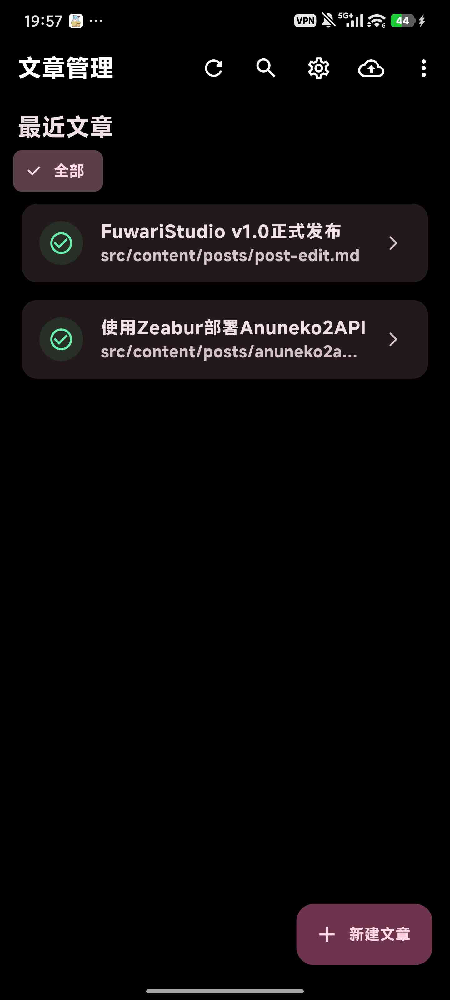

---
title: FuwariStudio v1.0正式发布
published: 2026-01-22
description: 闲的没事Vibe的文章编辑器.......适用于Astro Fuwari
image: JPEG_20260122_195732_2420647151095612769_1769083053469.jpg
tags:
  - 分享
  - FuwariStudio
category: 分享
draft: false
lang: ''
---
FuwariStudio 笔记编辑器

专注于Astro Fuwari的笔记编辑器。
由于黑曜石操作过于复杂且缺乏替代品，我决定使用 Flutter 开发一款跨平台笔记编辑器，兼顾简洁设计与高效体验。

---

Android 移动端界面:

采用 MiSans Bold 字体，优化视觉层次与阅读体验

---

特性:

· 跨平台支持：基于 Flutter 框架，兼容 Android 8 Later 与 Windows 10 Later
· 简洁交互：界面直观，降低学习成本
· 高效编辑：流畅的 Markdown 支持与实时预览
· 定制化字体：默认集成 MiSans Bold

📥 下载与体验
[链接文本](https://github.com/muyuzier-afk/FuwariStudio)
前往我们的Github Release页面下载客户端或自行编译打包。

---

让记录更简单，让灵感随时停留。

版权信息:
MiSans Bold和MiSanS有关商标归小米公司所有。

